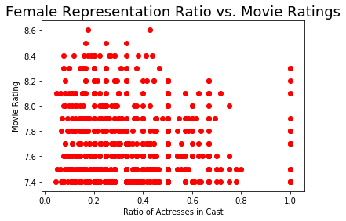
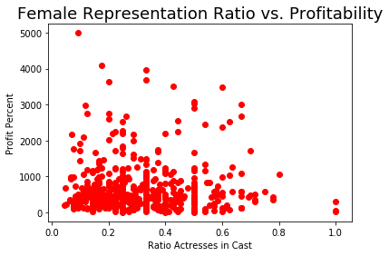
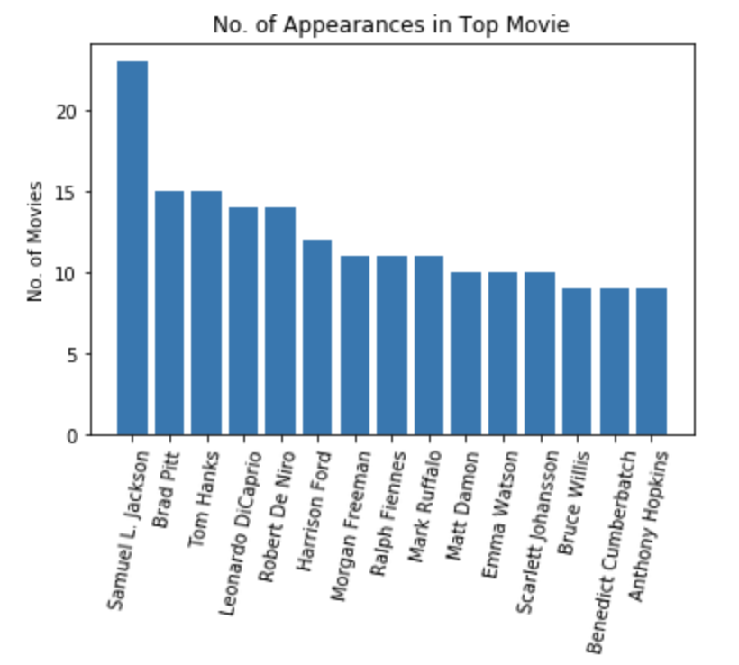
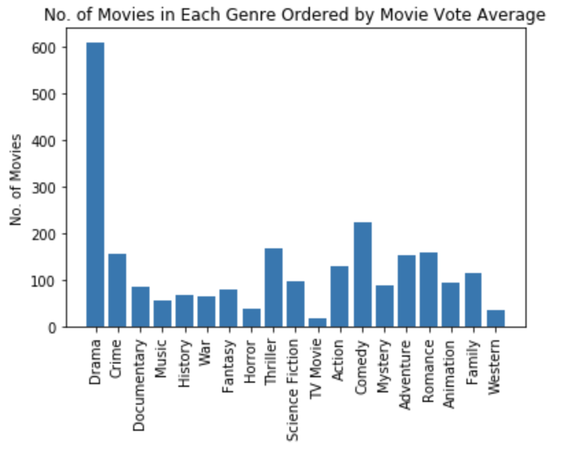

# Flatiron School Mod 1 Project

### Contributors: 
Nabil Abbas, Warren Tai, Rami Avni

## Goals:
- Form business insights for a hypothetical movie streaming service by using online data sources via API calls and webscraping.
- Access and wrangle scraped / called data by connecting to and uploading the data to AWS server 
- Query and tabulate data using SQL and Pandas
- Create Data Visualizations using Python packages such as Matplotlib to communicate findings to stakeholders.

## Questions:
- Are movie casts comprising of mostly male or female cast members?
    - What is the ratio?
- Is there an indication as to higher female cast member ratio to a movie's success?  
    - Compare profit percentage to female cast ratio per film.  
    - Compare movie rating to female cast ratio per film.
    - What are the genders of actors in the top paid grossing films?
- What genre is the most highly rated / profitting genre that the streaming service should focus on?
- Can we create a list of actors who's expertise is in a certain genre and visualize the data?

## Our Results and Insights
   
The scatter plot above is plotting the female cast ratio per film for a sample size of 704 movies.  Unfortunately the industry is still working on representation so there just isn't an even landscape of high female cast ratio vs high male cast ratio to come up with a meaningful conclusion.  But looking at the plot you can see that a majority of the films are condensed in the bottom left corner indicating higher male cast ratios.

  
The findings regarding profitability are similar to that of movie popularity.  There isn't enough data about higher female casts ratio per film to come up with a meaningful analysis. The data is inconclusive.

  
As we see from the graph above, the number of appearances in highly rated movies (we restrict to those movies with vote count greater than 100) is dominated by males, which is an interesting result echoing previous analysis of movies output based on gender.

  
Above is a graph of movies genre ordered by vote average (descending from left to right). This shows that vote average for the Drama genre is way higher than that of Comedy or Western. So in order to produce a highly rated movie, it should most likely be in the Drama genre.

## Going Forward and Future Analysis

#### Genre Analysis
Clearly drama is highly rated genre for movies.  It will be helpful for the streaming service to obtain profitability data so they may be able to decide how much of their resources should be dedicated to the drama genre.

#### Representation Analysis
We were able to conclude is that there has been a clear leaning towards greater male cast members in the movie industry.  But with that being said, it does not leave enough data to analyze the profitability and popularity of movies containing higher female ratio cast members.  Our team would ideally be on standby to collect more data as more films release keeping note of female cast ratios.

#### Actors / Actresses Expertise per Genre Study
We would like to complete the following study in the future - which stars are more likely to increase movie success in a particular genre. We scraped data from The Numbers about the Top Grossing Leading Stars. This data provides a direct relation between a specific actor and the overall success of every movie in which they had a leading role.

The data had already been scraped but due to time constraints was unable to queried, tabulated, and graphed.  Ultimately what this graph would represent is a list / visualization of the top actors available who's expertise are in a specfic genre.  This information is important in that it gives our stakeholder options for actors to choose from, taking into consideratino that hiring a top actor is one of the top expenses.  The streaming service would have a back up list of alternative actors.

Lastly regarding this incomplete study, this list can be broken down between top actors and actresses, to both help the streaming service as well further our study on female representation in the industry.

## API and Webscraping Sources:
- https://www.themoviedb.org/
- https://www.boxofficemojo.com/
- https://www.the-numbers.com/

